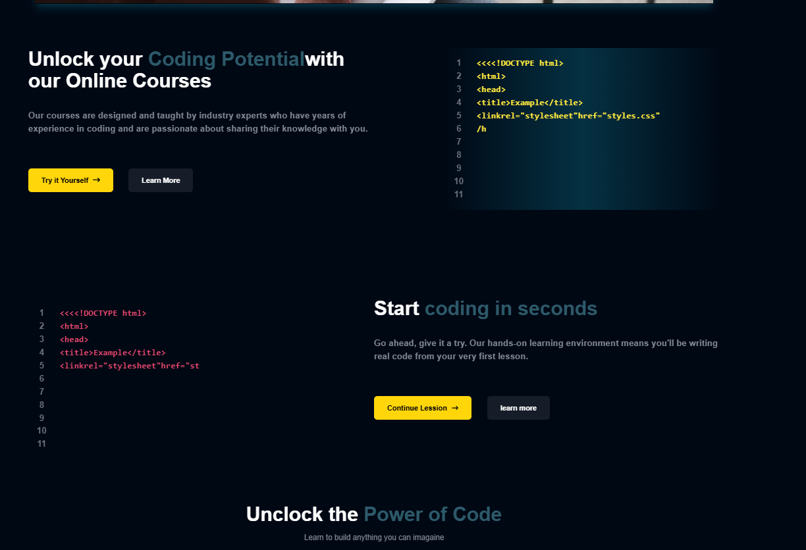
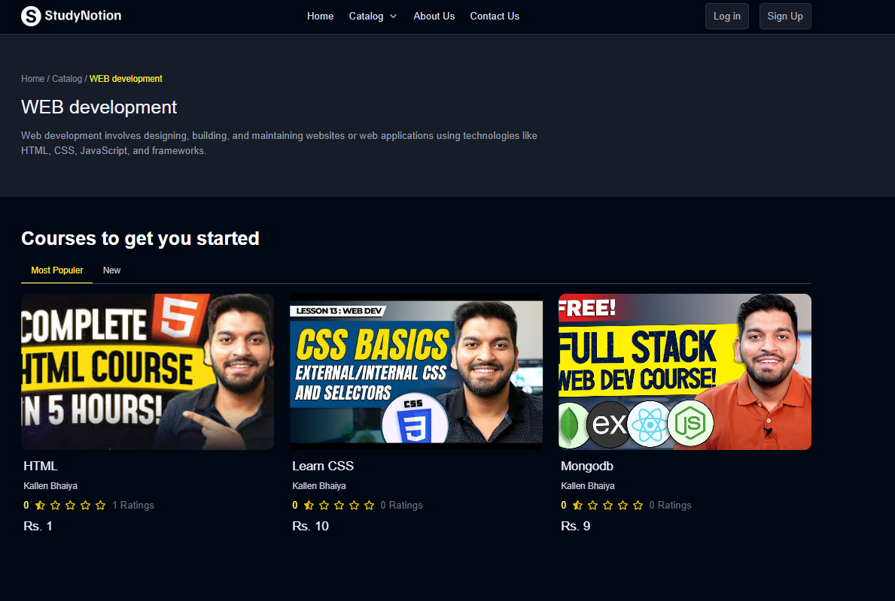

# StudyNotion - EdTech Platform 🚀

Welcome to **StudyNotion**, a fully functional **EdTech platform** designed for students and instructors to create, consume, and rate educational content. Built using the **MERN stack** (MongoDB, ExpressJS, ReactJS, and NodeJS), StudyNotion offers a seamless and interactive learning experience.

🌐 [Visit the website](https://study-notion-platform-three.vercel.app/)

## Screenshots

  
  


## Table of Contents
- [Introduction](#introduction)
- [System Architecture](#system-architecture)
  - [Front-end](#front-end)
  - [Back-end](#back-end)
  - [Database](#database)
- [Architecture Diagram](#architecture-diagram)
- [API Design](#api-design)
- [Installation](#installation)
- [Configuration](#configuration)
- [Usage](#usage)

## Introduction

StudyNotion aims to provide a platform for students and instructors to engage with educational content seamlessly. With intuitive features for creating, managing, and consuming courses, it makes learning more accessible and engaging.

The platform allows students to interact with courses and provides instructors the tools to manage and display their content globally.

## System Architecture

The platform consists of three key components:
- **Front-end**: Built with ReactJS to ensure a dynamic, responsive user interface.
- **Back-end**: Powered by NodeJS and ExpressJS, providing the logic and API endpoints for the platform.
- **Database**: Uses MongoDB for scalable, flexible data storage.

### Front-end

The front-end provides the interface for students and instructors to interact with the platform. It includes dynamic features like course lists, user profiles, and payment integrations.

**Pages for Students:**
- **Homepage**: Overview of the platform, links to course list, and user details.
- **Course List**: A comprehensive list of available courses with descriptions and ratings.
- **Wishlist**: Shows all the courses added to the student’s wishlist.
- **Cart Checkout**: A shopping cart to complete course purchases.
- **Course Content**: Displays the content for selected courses.
- **User Details**: Shows student account details.
- **User Edit Details**: Allows students to update their account information.

**Pages for Instructors:**
- **Dashboard**: Overview of all courses, ratings, and feedback.
- **Insights**: Data on views, clicks, and other metrics.
- **Course Management**: Tools to create, update, and delete courses.
- **Profile Management**: View and edit instructor details.

**Technologies:**
- ReactJS
- TailwindCSS (for styling)
- Redux (for state management)

### Back-end

The back-end handles API routes for user authentication, course management, and payment integration.

**Features:**
- **Authentication & Authorization**: Login, registration, OTP verification, and password reset.
- **Course Management**: CRUD operations for courses, course content management, and media handling.
- **Payment Integration**: Razorpay for secure payments.
- **Cloud Media Storage**: Uses Cloudinary for storing media like images and videos.
- **Markdown Support**: Course content stored and rendered using Markdown.

**Technologies:**
- Node.js
- Express.js
- MongoDB
- JWT (for authentication)
- Bcrypt (for password security)
- Mongoose (ODM for MongoDB)

### Database

MongoDB is used as the primary database, offering flexibility and scalability for storing user data, courses, and related content.

**Schemas:**
- **Student Schema**: Stores student details (name, email, courses).
- **Instructor Schema**: Stores instructor details (name, email, courses).
- **Course Schema**: Stores course details (name, description, media).

## Installation

To get started with the project, follow these steps:

1. **Clone the repository**:

   Open your terminal and clone the repository:

   ```bash
   git clone https://github.com/shubhamgiri9548/StudyNotion-Platform.git
2 Navigate to the project directory:

 cd StudyNotion-Platform

3 npm install

4 npm start

5 Access the app:
After the server starts, you can visit the frontend at http://localhost:3000 and start interacting with the platform.
